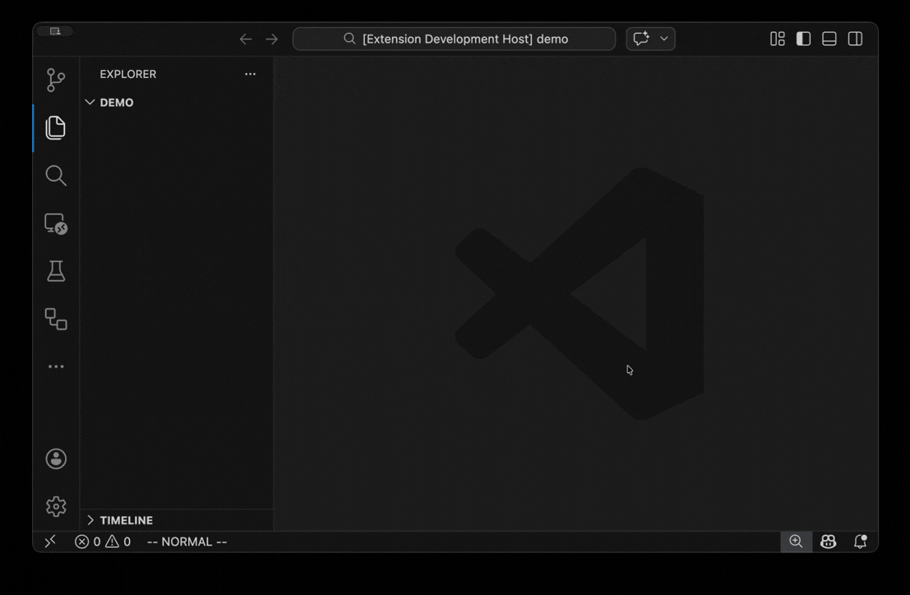

<div align="center">


# Newf

**Create new files and folders from the command palette.** \
Fast, minimal, with full brace expansion.

[](https://marketplace.visualstudio.com/items?itemName=kazuito.newf)
&nbsp;
[](https://github.com/kazuito/newf)



</div>

## Installation

Search for **Newf** in the extensions tab on VSCode, or install from the command line:

```sh
code --install-extension kazuito.newf
```

## Usage

Open the command palette (`Cmd+Shift+P` / `Ctrl+Shift+P`) and run:

```
Newf: Create New File
```

1. Select a target directory from the quick pick list.
2. Enter a file name or pattern.
3. The file is created and opened in the editor.

Directories are created automatically. If the file already exists, it is opened without overwriting.

## Brace Expansion

newf supports full brace expansion, so you can create multiple files in a single command.

**Comma-separated lists**

```
components/{Header,Footer,Sidebar}.tsx
```

Creates `components/Header.tsx`, `components/Footer.tsx`, and `components/Sidebar.tsx`.

**Numeric ranges**

```
pages/page-{01..05}.md
```

Creates `pages/page-01.md` through `pages/page-05.md`.

**Nested patterns**

```
src/{components/{Button,Input},hooks/use{Auth,Theme}}.ts
```

Creates four files across two directories.

**Multiple entries**

Separate unrelated files with commas at the top level:

```
README.md, LICENSE, src/index.ts
```

There is a safety limit of 100 expanded files per command.

## File Templates

Automatically seed new files with starter content using the `newf.templates` setting. Map simple glob patterns to template strings.

Available template variables:
- `${name}`: file stem without the final extension
- `${basename}`: full filename including extension
- `${ext}`: final extension including the leading `.`
- `${dir}`: parent directory relative to the workspace root, or `.`
- `${workspaceFolder}`: absolute path to the selected workspace root
- `${date}`: local date in `YYYY-MM-DD`

```json
"newf.templates": {
  "*.tsx": "export default function ${name}() {\n  return <div />;\n}\n",
  "*.md": "---\ntitle: ${name}\ndate: ${date}\npath: ${dir}/${basename}\nworkspace: ${workspaceFolder}\n---\n",
  "*.test.ts": "import { describe, it } from 'node:test';\n\n",
  "src/**/*.ts": "// ${name}\n"
}
```

**Matching rules:**
- Patterns without `/` match the basename only (e.g. `*.tsx`)
- Patterns with `/` match the workspace-relative path (e.g. `src/**/*.ts`)
- Supports `*` (within one path segment) and `**` (across segments)
- First matching pattern wins
- Existing files are never overwritten regardless of templates

## Directory Creation

In the directory picker, type a path that doesn't exist yet to get a **Create directory** option at the top of the list. Accepting it creates the directory and proceeds directly to the filename input — no need to leave the flow.

## Directory Listing

The quick pick menu shows all directories in your workspace. In git repositories, it uses `git ls-files` to respect your `.gitignore`. Non-git projects fall back to a filesystem walk that excludes hidden directories and `node_modules`.

The root directory (`.`) is always available.

## Security

Path traversal is blocked. Inputs like `../../etc/passwd` that resolve outside the selected base directory are rejected.

## Requirements

- VSCode 1.100.0 or later

## Development

```sh
pnpm install
pnpm compile      # Build
pnpm watch        # Build in watch mode
pnpm lint         # Lint and format check (Biome)
pnpm test         # Compile, lint, and run tests
pnpm typecheck    # Type check without emitting
```

## License

MIT
